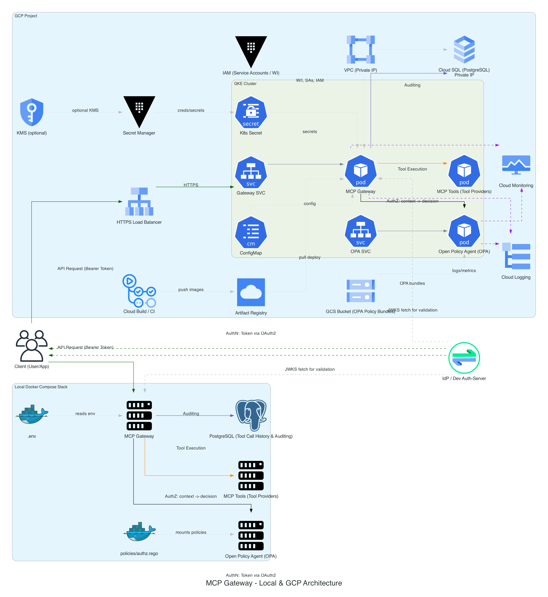

# MCP Gateway

A Docker-based implementation of the Docker MCP Gateway with OAuth2 authentication, OPA policy enforcement, and comprehensive tool call auditing.

## Purpose

This project provides a production-ready MCP Gateway implementation using Docker's official MCP Gateway container. It includes:

- **OAuth2/JWT Authentication** with admin and user role support
- **OPA Policy Enforcement** for fine-grained access control
- **PostgreSQL Audit Logging** for all tool calls and decisions
- **Docker Compose** for easy local development and deployment
- **Portable Architecture** supporting both local and GCP environments

## Quick Start

See [Quick Start Guide](docs/QUICKSTART.md) for detailed installation and usage instructions.

## Project Status

### Phase 1: Core Infrastructure & Documentation
- [x] Project scaffolding and documentation
- [x] Architecture diagram with portable icons
- [x] Docker Compose setup with MCP Gateway, OPA, and PostgreSQL
- [x] OPA policy implementation
- [x] Database schema for tool call auditing
- [x] Environment configuration examples
- [x] Makefile with common targets
- **Status: Complete** (2025-08-04)

### Phase 2: Authentication & Authorization
- [ ] OAuth2 provider integration
- [ ] JWT token validation and parsing
- [ ] Role-based access control (RBAC) implementation
- [ ] Admin/user role differentiation
- [ ] Scope-based tool action authorization
- **Status: In Development**

### Phase 3: Tool Integration & Testing
- [ ] Sample tool provider implementation
- [ ] Integration testing suite
- [ ] Health check endpoints
- [ ] Policy test cases
- [ ] Performance benchmarking
- **Status: Not Started** (Planned: 2025-08-15)

### Phase 4: Production Hardening
- [ ] TLS/SSL configuration
- [ ] Rate limiting implementation
- [ ] Monitoring and alerting setup
- [ ] Backup and recovery procedures
- [ ] Security audit and penetration testing
- **Status: Not Started** (Planned: 2025-08-25)

## Features

- **MCP Gateway**: Docker's official MCP Gateway container with JWT validation
- **Policy Enforcement**: Open Policy Agent (OPA) for declarative authorization
- **Audit Trail**: Comprehensive logging of all tool calls and policy decisions
- **Role-Based Access**: Admin and user roles with scope-based permissions
- **Portable Deployment**: Works locally with Docker Compose or in GCP
- **Extensible Design**: Easy integration with additional tool providers

## Architecture

The system consists of three main components:

1. **MCP Gateway**: The core service that validates JWT tokens and enforces OPA policies
2. **OPA**: Open Policy Agent that makes authorization decisions based on Rego policies
3. **PostgreSQL**: Database for storing tool call history and audit events

See the [architecture diagram](docs/diagrams/mcp_gateway_architecture.png) for detailed component interactions.

## Documentation

- [Project Requirements Document (PRD)](docs/PRD.md)
- [Quick Start Guide](docs/QUICKSTART.md)
- [Dependencies and Inventory](docs/dependencies-and-inventory.md)
- [Policy Decision Points](docs/PDP.md)
- [Architecture Diagram Source](docs/diagrams/mcp_gateway_architecture.py)

## License

This project is licensed under the MIT License - see the [LICENSE](LICENSE) file for details.
## Status

- Phase 1: COMPLETE
- Phase 2: COMPLETE
  - T110: COMPLETE
  - T125: COMPLETE
  - T130: COMPLETE

